# FractalDataWorks Developer Kit - Architecture Overview

**Complete architectural reference for the FractalDataWorks framework ecosystem**

## Table of Contents

- [Executive Summary](#executive-summary)
- [High-Level Architecture](#high-level-architecture)
- [Project Dependency Graph](#project-dependency-graph)
- [Framework Layers](#framework-layers)
- [Source Generator Flow](#source-generator-flow)
- [Key Design Principles](#key-design-principles)
- [Integration Patterns](#integration-patterns)

## Executive Summary

The FractalDataWorks Developer Kit is a comprehensive .NET framework built on Railway-Oriented Programming principles, providing a service-oriented architecture with advanced source generation capabilities. The framework is structured in layers, from abstractions to concrete implementations, with extensive use of compile-time code generation for type safety and performance.

### Core Capabilities

- **Service-Oriented Architecture**: Plugin-based service framework with command execution and configuration management
- **Enhanced Enums**: Type-safe enum pattern with source-generated collections and cross-assembly discovery
- **Type Collections**: High-performance, extensible type discovery system with O(1) lookups
- **Result Pattern**: Railway-Oriented Programming with structured messaging
- **Source Generators**: Compile-time code generation for collections, messages, and service types
- **MCP Integration**: Model Context Protocol tooling for AI-assisted development

## High-Level Architecture

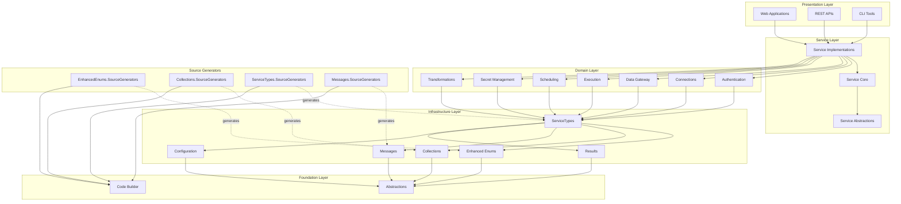

## Project Dependency Graph

### Core Framework Dependencies

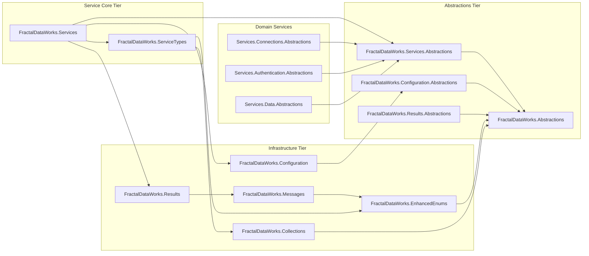

### Source Generator Dependencies

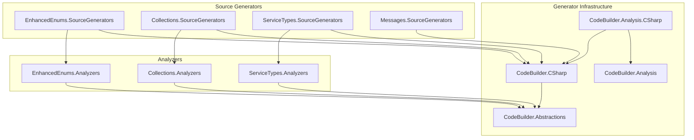

## Framework Layers

### Layer 1: Abstractions (netstandard2.0)

**Purpose**: Define contracts and interfaces with minimal dependencies

**Key Projects**:
- `FractalDataWorks.Abstractions` - Core interfaces and base types
- `FractalDataWorks.Services.Abstractions` - Service contracts and command interfaces
- `FractalDataWorks.Configuration.Abstractions` - Configuration contracts
- `FractalDataWorks.Results.Abstractions` - Result pattern interfaces

**Characteristics**:
- No implementation code
- Interface-only or abstract base classes
- Compatible with .NET Standard 2.0 for maximum reach
- No dependencies on concrete implementations

### Layer 2: Core Infrastructure (net10.0 / netstandard2.0)

**Purpose**: Provide fundamental building blocks for the framework

**Key Projects**:
- `FractalDataWorks.EnhancedEnums` - Type-safe enum pattern
- `FractalDataWorks.Collections` - High-performance type collections
- `FractalDataWorks.Messages` - Structured messaging system
- `FractalDataWorks.Results` - Result pattern implementation
- `FractalDataWorks.Configuration` - Configuration management

**Characteristics**:
- Concrete implementations of core patterns
- Heavy use of source generation
- Optimized for performance (.NET 8+ features where applicable)
- Minimal external dependencies

### Layer 3: Service Foundation (net10.0)

**Purpose**: Service-oriented architecture foundation

**Key Projects**:
- `FractalDataWorks.ServiceTypes` - Service type discovery and registration
- `FractalDataWorks.Services` - Service base classes and lifecycle management

**Characteristics**:
- Builds on infrastructure layer
- Provides base classes for domain services
- Integrates DI, configuration, logging, and results
- Supports plugin architecture

### Layer 4: Domain Services (net10.0)

**Purpose**: Specific business domain implementations

**Key Projects**:
- `FractalDataWorks.Services.Authentication.*` - Authentication services
- `FractalDataWorks.Services.Connections.*` - Database and external connections
- `FractalDataWorks.Services.Data.*` - Data access services
- `FractalDataWorks.Services.Execution.*` - Execution pipeline services
- `FractalDataWorks.Services.Scheduling.*` - Job scheduling services
- `FractalDataWorks.Services.SecretManagers.*` - Secret management services
- `FractalDataWorks.Services.Transformations.*` - Data transformation services

**Characteristics**:
- Domain-specific abstractions and implementations
- Provider pattern for multiple implementations
- Command-based execution model
- Full integration with service infrastructure

### Layer 5: Web and Integration (net10.0)

**Purpose**: HTTP and web service integration

**Key Projects**:
- `FractalDataWorks.Web.Http.Abstractions` - HTTP abstractions
- `FractalDataWorks.Web.RestEndpoints` - REST endpoint utilities
- `FractalDataWorks.Services.Connections.Rest` - REST client services

**Characteristics**:
- Web-specific functionality
- HTTP client abstractions
- Endpoint configuration
- Integration with service layer

### Layer 6: Development Tools

**Purpose**: Code generation and analysis during compilation

**Key Projects**:
- `FractalDataWorks.EnhancedEnums.SourceGenerators` - Enum collection generation
- `FractalDataWorks.Collections.SourceGenerators` - Type collection generation
- `FractalDataWorks.ServiceTypes.SourceGenerators` - Service type collection generation
- `FractalDataWorks.Messages.SourceGenerators` - Message collection generation
- `FractalDataWorks.*. Analyzers` - Code analyzers for each domain
- `FractalDataWorks.*.CodeFixes` - Automatic code fixes

**Characteristics**:
- Compile-time code generation
- Roslyn-based analyzers
- ILRepack for dependency merging
- netstandard2.0 target for analyzer compatibility

### Layer 7: MCP Tools

**Purpose**: AI-assisted development tooling via Model Context Protocol

**Key Projects**:
- `FractalDataWorks.MCP.Abstractions` - MCP base contracts
- `FractalDataWorks.McpTools.CodeAnalysis` - Code analysis tools
- `FractalDataWorks.McpTools.Refactoring` - Refactoring tools
- `FractalDataWorks.McpTools.SessionManagement` - Session management
- `FractalDataWorks.McpTools.VirtualEditing` - Non-destructive editing
- `FractalDataWorks.McpTools.TypeAnalysis` - Type system analysis
- `FractalDataWorks.McpTools.ProjectDependencies` - Dependency analysis
- `FractalDataWorks.McpTools.ServerManagement` - MCP server lifecycle

**Characteristics**:
- Roslyn-based code analysis
- Virtual editing capabilities
- Integration with AI assistants
- Real-time code intelligence

## Source Generator Flow

### 1. Enhanced Enums Source Generator

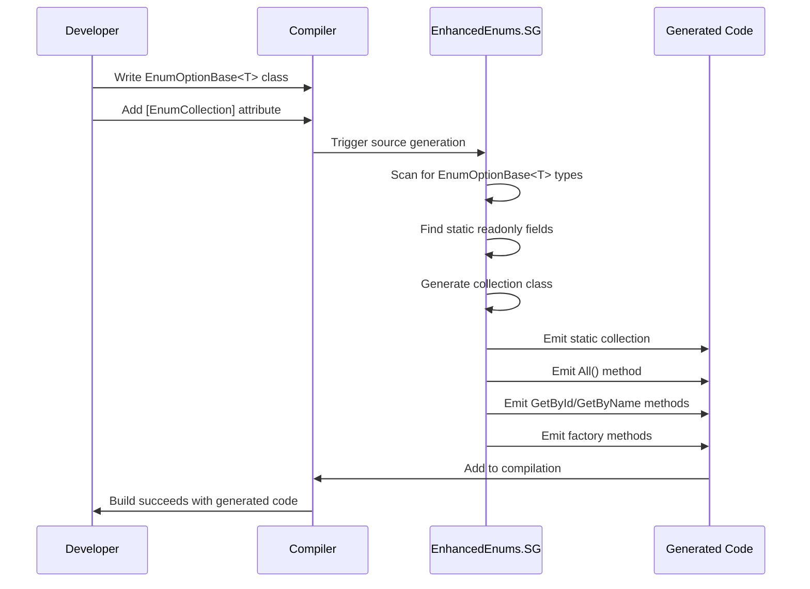

**Key Steps**:
1. Developer creates class inheriting from `EnumOptionBase<T>`
2. Developer adds `[EnumCollection]` or `[GlobalEnumCollection]` attribute to collection class
3. Generator scans for all `static readonly` fields of the enum type
4. Generator creates collection class with:
   - Static `_all` field populated with all instances
   - `All()` method returning all instances
   - `GetById(int)` and `GetByName(string)` lookup methods
   - Factory methods for each instance

### 2. Type Collections Source Generator

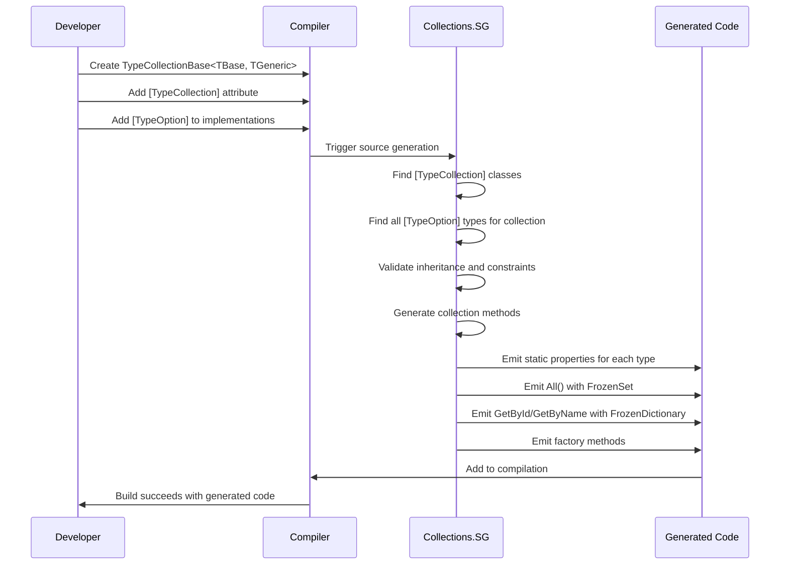

**Key Steps**:
1. Developer creates collection class with `[TypeCollection(baseType, returnType, collectionType)]`
2. Developer marks each implementation with `[TypeOption(collectionType, name)]`
3. Generator finds all types with matching `[TypeOption]` attribute
4. Generator validates type hierarchy and constraints
5. Generator creates collection with:
   - Static property for each discovered type
   - `All()` method returning `FrozenSet<TGeneric>`
   - `GetById(int)` and `GetByName(string)` using `FrozenDictionary`
   - Factory methods for each type with all constructor overloads

### 3. ServiceTypes Source Generator

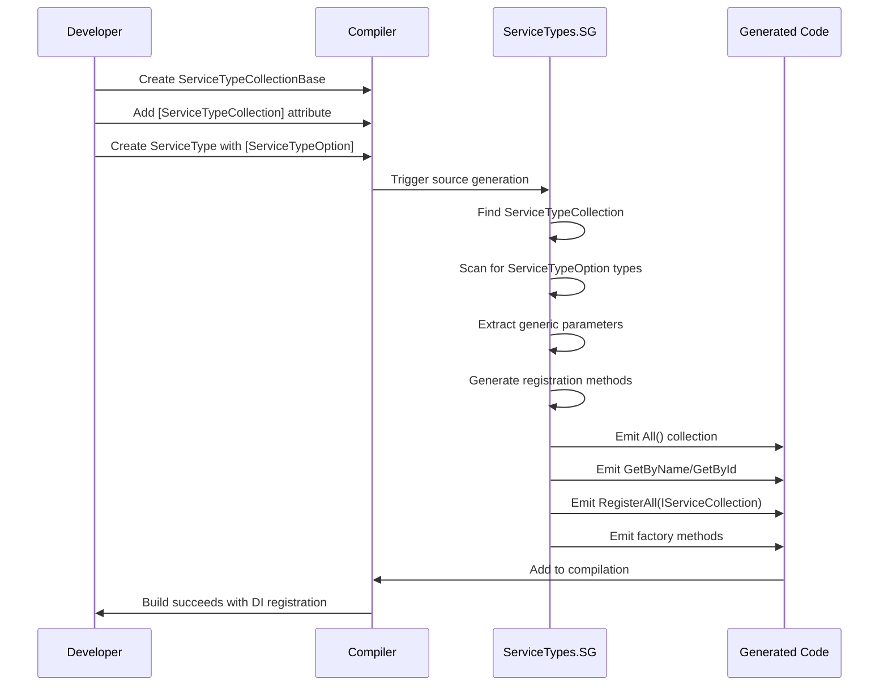

**Key Steps**:
1. Developer creates ServiceTypeCollection with `[ServiceTypeCollection]` attribute
2. Developer creates ServiceType classes with `[ServiceTypeOption]` attribute
3. Generator discovers all service types for the collection
4. Generator extracts `TService`, `TConfiguration`, `TFactory` from generic parameters
5. Generator creates collection with:
   - `All()` returning all service types
   - `GetByName(string)` and `GetById(int)` lookups
   - `RegisterAll(IServiceCollection)` for DI registration
   - Factory methods for service creation

### 4. Messages Source Generator

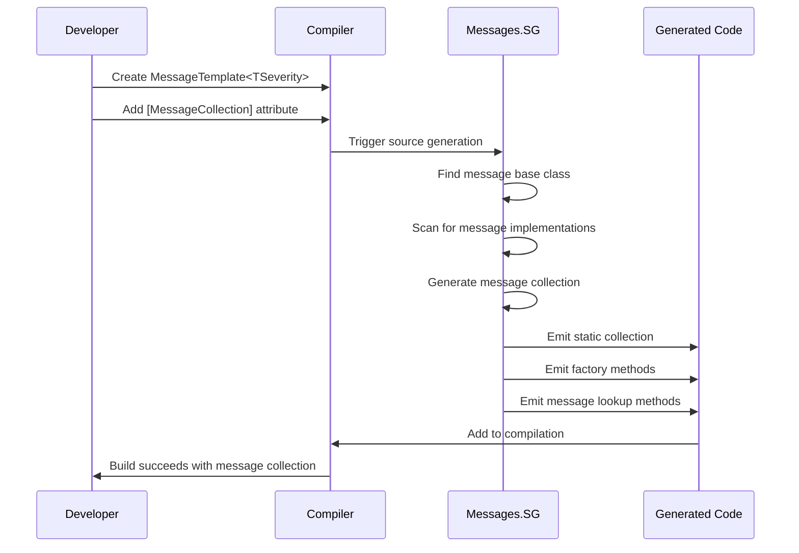

**Key Steps**:
1. Developer creates message class inheriting from `MessageTemplate<TSeverity>`
2. Developer adds `[MessageCollection("CollectionName")]` attribute
3. Generator finds all message types inheriting from the base
4. Generator creates collection with:
   - Static instances for each message type
   - Factory methods for message creation
   - Lookup methods by message code/name

## Key Design Principles

### 1. Railway-Oriented Programming

**Principle**: Operations return `IGenericResult` or `IGenericResult<T>` instead of throwing exceptions

**Implementation**:
```csharp
// Traditional approach (exceptions)
public User GetUser(int id)
{
    if (id <= 0) throw new ArgumentException("Invalid ID");
    var user = _repository.GetById(id);
    if (user == null) throw new UserNotFoundException(id);
    return user;
}

// Railway-Oriented approach (results)
public IGenericResult<User> GetUser(int id)
{
    if (id <= 0)
        return GenericResult<User>.Failure("Invalid user ID");

    var user = _repository.GetById(id);
    if (user == null)
        return GenericResult<User>.Failure($"User {id} not found");

    return GenericResult<User>.Success(user);
}
```

**Benefits**:
- Explicit error handling in method signatures
- No hidden control flow from exceptions
- Composable with Map/Match methods
- Performance benefits (no exception overhead)

### 2. Source Generation Over Reflection

**Principle**: Generate code at compile-time instead of using runtime reflection

**Implementation**:
- Enhanced Enums: Collections generated at compile-time
- Type Collections: FrozenDictionary lookups generated at compile-time
- ServiceTypes: Registration code generated at compile-time
- Messages: Message collections generated at compile-time

**Benefits**:
- Zero runtime reflection overhead
- Compile-time type safety
- IntelliSense support for generated code
- Better performance (pre-computed lookups)

### 3. Dependency Injection First

**Principle**: All services registered via DI container, no service locator pattern

**Implementation**:
```csharp
// ServiceType handles registration
public class EmailServiceType : ServiceTypeBase<IEmailService, EmailConfiguration, IEmailServiceFactory>
{
    public override void Register(IServiceCollection services)
    {
        services.AddScoped<IEmailService, EmailService>();
        services.AddScoped<IEmailServiceFactory, EmailServiceFactory>();
        services.AddScoped<EmailServiceProvider>();
    }
}

// Generated collection registers all service types
public static void RegisterAll(IServiceCollection services)
{
    foreach (var serviceType in All())
    {
        serviceType.Register(services);
    }
}
```

**Benefits**:
- Testable (easy to mock dependencies)
- Configurable (lifetime management)
- Discoverable (via DI container)
- No hidden dependencies

### 4. Plugin Architecture

**Principle**: Framework extensible without modifying core code

**Implementation**:
- Collections in abstractions projects for discoverability
- `[TypeOption]` allows any assembly to add implementations
- Service types discovered automatically via attributes
- No central registry required

**Benefits**:
- Open/Closed Principle compliance
- Easy to add new implementations
- No framework modifications required
- Compile-time validation of plugins

### 5. Explicit Over Implicit

**Principle**: Use attributes and explicit declarations over convention-based discovery

**Implementation**:
```csharp
// Explicit collection targeting
[TypeOption(typeof(SecurityMethods), "CustomAuth")]
public class CustomAuthMethod : SecurityMethodBase
{
    // Implementation
}

// Explicit service type registration
[ServiceTypeOption(typeof(ConnectionTypes), "SqlServer")]
public class SqlServerConnectionType : ConnectionTypeBase<...>
{
    // Implementation
}
```

**Benefits**:
- Clear intent and relationships
- Compile-time validation
- No runtime scanning overhead
- Better IDE support

### 6. Immutability and Thread Safety

**Principle**: Use immutable data structures and thread-safe collections

**Implementation**:
- `FrozenDictionary` and `FrozenSet` for collections (.NET 8+)
- `ImmutableArray` for older frameworks
- `ReadOnlyCollection` for public APIs
- Init-only properties for configuration

**Benefits**:
- Thread-safe by default
- No defensive copying
- Performance benefits (optimized for reads)
- Prevents accidental mutations

## Integration Patterns

### Pattern 1: Service Domain Creation

**Complete flow for creating a new service domain**:

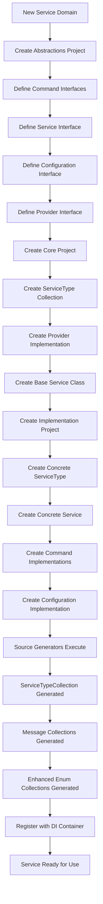

### Pattern 2: Enhanced Enum to TypeCollection Evolution

**Evolution from simple enum to extensible collection**:

1. **Phase 1: Simple Enhanced Enum**
```csharp
// Single assembly, fixed values
public class Priority : EnumOptionBase<Priority>
{
    public static readonly Priority Low = new(1, "Low");
    public static readonly Priority High = new(2, "High");
}

[EnumCollection("PriorityCollection")]
public partial class PriorityCollection : EnumCollectionBase<Priority>
{
}
```

2. **Phase 2: Cross-Project TypeCollection**
```csharp
// Abstractions: Define collection
[TypeCollection(typeof(PriorityBase), typeof(IPriority), typeof(Priorities))]
public partial class Priorities : TypeCollectionBase<PriorityBase, IPriority>
{
}

// Concrete: Define base
public abstract class PriorityBase : IPriority
{
    protected PriorityBase(int id, string name) { }
}

// Any Project: Add implementations
[TypeOption(typeof(Priorities), "Low")]
public class LowPriority : PriorityBase { }

[TypeOption(typeof(Priorities), "High")]
public class HighPriority : PriorityBase { }
```

### Pattern 3: Command Execution Flow

**End-to-end command execution with results and messages**:

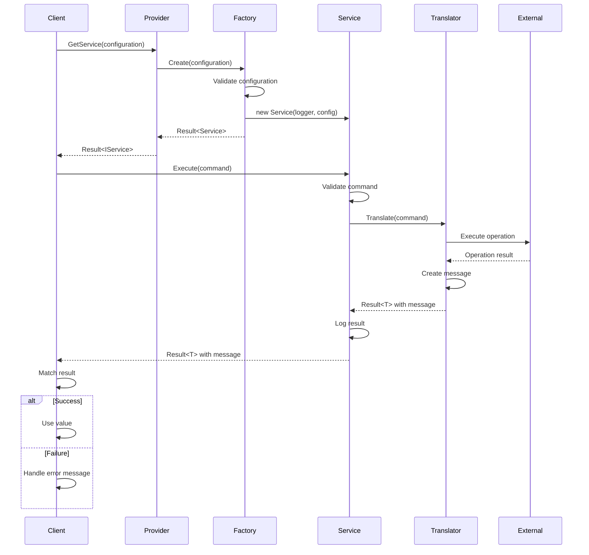

### Pattern 4: Source Generator Chain

**How multiple source generators work together**:

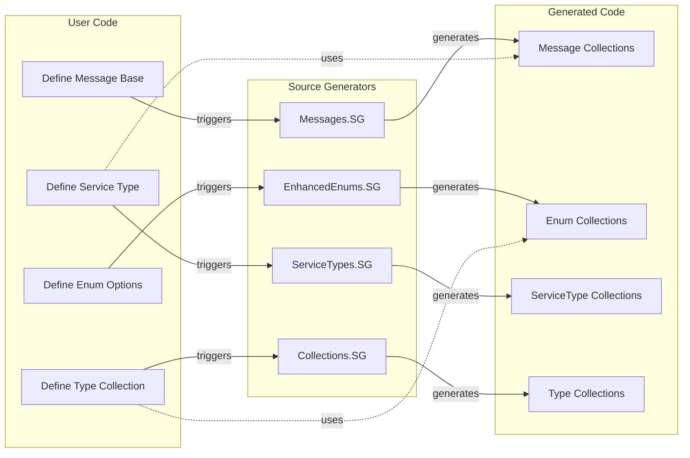

### Pattern 5: Configuration Hierarchy

**Configuration flows from appsettings.json through the service stack**:

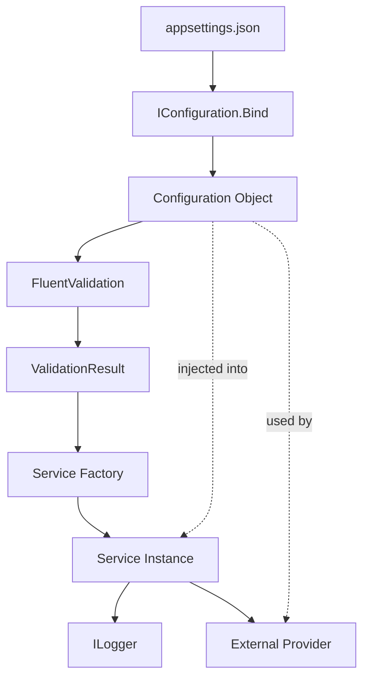

**Example Flow**:
1. `appsettings.json` contains configuration sections
2. `IConfiguration` binds JSON to strongly-typed configuration objects
3. `FluentValidation` validates configuration in factory `Create()` method
4. Valid configuration injected into service constructor
5. Service uses configuration for provider initialization
6. Configuration values logged for diagnostics

---

## Summary

The FractalDataWorks Developer Kit architecture is built on these key foundations:

1. **Layered Architecture**: Clear separation from abstractions to implementations
2. **Source Generation**: Compile-time code generation for performance and type safety
3. **Plugin System**: Extensible via attributes without modifying core framework
4. **Railway-Oriented Programming**: Explicit error handling with Result pattern
5. **Dependency Injection**: First-class DI support throughout the stack
6. **Cross-Assembly Discovery**: Type collections enable framework extensibility

This architecture enables building complex service-oriented applications with compile-time safety, runtime performance, and excellent developer experience through comprehensive tooling support.
