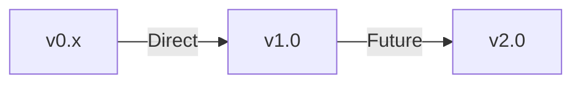

# FractalDataWorks Developer Kit - Migration Guide

**Complete guide for upgrading between FractalDataWorks versions with breaking changes, deprecated patterns, and migration checklists**

## Table of Contents

- [Version History](#version-history)
- [Migration Paths](#migration-paths)
- [Breaking Changes by Version](#breaking-changes-by-version)
- [Deprecated Patterns](#deprecated-patterns)
- [Migration Checklists](#migration-checklists)
- [Automated Migration Tools](#automated-migration-tools)

## Version History

### Current: v1.0 (.NET 10.0)
- Enhanced Enums with cross-assembly discovery
- Type Collections with explicit targeting
- ServiceTypes with plugin architecture
- Messages with severity levels
- Full .NET 10 support
- xUnit v3 for testing

### Previous Versions

This section will be populated as new versions are released.

## Migration Paths

### Recommended Migration Sequence

When upgrading across multiple versions, follow this sequence:



### Framework Version Requirements

| FractalDataWorks Version | Minimum .NET | Target .NET | C# Version |
|-----------------|--------------|-------------|------------|
| v1.0 | .NET 6.0 | .NET 10.0 | C# 12 |
| Future v2.0 | .NET 8.0 | .NET 11.0 | C# 13 |

## Breaking Changes by Version

### v1.0 Breaking Changes

#### 1. ServiceTypeBase Generic Parameter Reordering

**Breaking Change**: Generic parameters reordered from `<TService, TConfiguration, TFactory>` to `<TService, TFactory, TConfiguration>`

**Old Pattern**:
```csharp
public abstract class ServiceTypeBase<TService, TConfiguration, TFactory>
    where TService : class
    where TConfiguration : class
    where TFactory : class
{
    // Implementation
}
```

**New Pattern**:
```csharp
public abstract class ServiceTypeBase<TService, TFactory, TConfiguration>
    where TService : class
    where TFactory : class
    where TConfiguration : class
{
    // Implementation
}
```

**Migration**:
```csharp
// Before
public class EmailServiceType : ServiceTypeBase<IEmailService, EmailConfiguration, IEmailServiceFactory>
{
    // Implementation
}

// After
public class EmailServiceType : ServiceTypeBase<IEmailService, IEmailServiceFactory, EmailConfiguration>
{
    // Implementation - swap Factory and Configuration positions
}
```

**Automated Fix**: Use Find & Replace with regex:
```regex
Find: ServiceTypeBase<([^,]+), ([^,]+), ([^>]+)>
Replace: ServiceTypeBase<$1, $3, $2>
```

#### 2. TypeCollection Requires Explicit [TypeOption] Attribute

**Breaking Change**: Type discovery now requires explicit `[TypeOption]` attribute instead of inheritance scanning

**Old Pattern** (inheritance-based):
```csharp
// Just inherit - automatically discovered
public class JwtSecurityMethod : SecurityMethodBase
{
    public JwtSecurityMethod() : base(1, "JWT", true) { }
}
```

**New Pattern** (attribute-based):
```csharp
// Must add [TypeOption] attribute
[TypeOption(typeof(SecurityMethods), "JWT")]
public class JwtSecurityMethod : SecurityMethodBase
{
    public JwtSecurityMethod() : base(1, "JWT", true) { }
}
```

**Migration Steps**:
1. Find all types inheriting from collection base types
2. Add `[TypeOption(typeof(CollectionType), "TypeName")]` to each
3. Rebuild to verify source generation

**Automated Fix**: Use the Collections.Analyzers package which provides code fixes for TC001 diagnostic.

#### 3. IGenericResult Message Property Behavior

**Breaking Change**: `Message` property on `IGenericResult` interface now throws `InvalidOperationException` on successful results

**Old Pattern**:
```csharp
var result = GenericResult.Success("Operation completed");
var message = result.Message; // Returned "Operation completed"
```

**New Pattern**:
```csharp
var result = GenericResult.Success("Operation completed");
// var message = result.Message; // Throws InvalidOperationException for IGenericResult interface

// Use concrete type or Messages property
var concreteResult = (GenericResult)result;
var message = concreteResult.Message; // OK - returns first message or empty string

// Or use Messages collection
var messages = result.Messages; // Always safe
```

**Migration**:
```csharp
// Before
public string GetResultMessage(IGenericResult result)
{
    return result.Message; // Throws on success in v1.0
}

// After
public string GetResultMessage(IGenericResult result)
{
    return result.Messages.FirstOrDefault()?.Message ?? string.Empty;
    // Or cast to concrete type:
    // return ((GenericResult)result).Message;
}
```

#### 4. Source Generator Package References

**Breaking Change**: Source generators must use `OutputItemType="Analyzer"` and `ReferenceOutputAssembly="false"`

**Old Pattern**:
```xml
<PackageReference Include="FractalDataWorks.EnhancedEnums.SourceGenerators" Version="1.0.0" />
```

**New Pattern**:
```xml
<PackageReference Include="FractalDataWorks.EnhancedEnums.SourceGenerators" Version="1.0.0"
                  OutputItemType="Analyzer"
                  ReferenceOutputAssembly="false" />
```

**Migration**: Update all `.csproj` files with source generator references:

```bash
# PowerShell script to update all .csproj files
Get-ChildItem -Recurse -Filter *.csproj | ForEach-Object {
    $content = Get-Content $_.FullName
    $content = $content -replace '<PackageReference Include="FractalDataWorks\..*\.SourceGenerators"([^>]*)/>',
        '<PackageReference Include="FractalDataWorks.$1.SourceGenerators"$2 OutputItemType="Analyzer" ReferenceOutputAssembly="false" />'
    Set-Content $_.FullName $content
}
```

#### 5. Enhanced Enum Collection Base Class Changes

**Breaking Change**: `EnumCollectionBase<T>` now requires `partial` modifier for source generation

**Old Pattern**:
```csharp
[EnumCollection("Priority")]
public sealed class PriorityCollection : EnumCollectionBase<Priority>
{
    // Manual _all population required
    protected override ImmutableArray<Priority> InitializeAll()
    {
        return ImmutableArray.Create(Priority.Low, Priority.Medium, Priority.High);
    }
}
```

**New Pattern**:
```csharp
[EnumCollection("Priority")]
public sealed partial class PriorityCollection : EnumCollectionBase<Priority>
{
    // Generator automatically populates _all - remove manual initialization
}
```

**Migration**:
1. Add `partial` modifier to collection classes
2. Remove manual `InitializeAll()` override
3. Remove manual `_all` field initialization
4. Rebuild to trigger source generation

## Deprecated Patterns

### Pattern 1: Manual Collection Population

**Status**: Deprecated in v1.0, will be removed in v2.0

**Deprecated**:
```csharp
public class MyCollection : TypeCollectionBase<MyType>
{
    private static ImmutableArray<MyType> _all = ImmutableArray.Create(
        MyType.Instance1,
        MyType.Instance2
    );

    public static ImmutableArray<MyType> All() => _all;
}
```

**Replacement**:
```csharp
[TypeCollection(typeof(MyTypeBase), typeof(IMyType), typeof(MyCollection))]
public partial class MyCollection : TypeCollectionBase<MyTypeBase, IMyType>
{
    // Source generator populates everything
}

[TypeOption(typeof(MyCollection), "Instance1")]
public class MyType1 : MyTypeBase { }
```

### Pattern 2: Exception-Based Error Handling in Services

**Status**: Deprecated in v1.0

**Deprecated**:
```csharp
public User GetUser(int id)
{
    if (id <= 0)
        throw new ArgumentException("Invalid ID");

    var user = _repository.GetById(id);
    if (user == null)
        throw new UserNotFoundException(id);

    return user;
}
```

**Replacement**:
```csharp
public IGenericResult<User> GetUser(int id)
{
    if (id <= 0)
        return GenericResult<User>.Failure("Invalid user ID");

    var user = _repository.GetById(id);
    if (user == null)
        return GenericResult<User>.Failure($"User {id} not found");

    return GenericResult<User>.Success(user);
}
```

### Pattern 3: Direct DI Registration

**Status**: Deprecated in v1.0, use ServiceTypes instead

**Deprecated**:
```csharp
// In Startup.cs or Program.cs
services.AddScoped<IEmailService, EmailService>();
services.AddScoped<IEmailServiceFactory, EmailServiceFactory>();
```

**Replacement**:
```csharp
// Create ServiceType
[ServiceTypeOption(typeof(EmailServiceTypes), "Smtp")]
public class SmtpEmailServiceType : EmailServiceTypeBase<...>
{
    public override void Register(IServiceCollection services)
    {
        services.AddScoped<IEmailService, SmtpEmailService>();
        services.AddScoped<IEmailServiceFactory, SmtpEmailServiceFactory>();
    }
}

// Register all service types
EmailServiceTypes.RegisterAll(services);
```

### Pattern 4: Async Method Naming with "Async" Suffix

**Status**: Deprecated in v1.0

**Deprecated**:
```csharp
public async Task<IGenericResult> ExecuteAsync(ICommand command)
{
    // Implementation
}
```

**Replacement**:
```csharp
public async Task<IGenericResult> Execute(ICommand command)
{
    // Implementation - Task return type makes async obvious
}
```

### Pattern 5: Mutable Configuration Objects

**Status**: Deprecated in v1.0

**Deprecated**:
```csharp
public class EmailConfiguration : IEmailConfiguration
{
    public string SmtpServer { get; set; } = string.Empty;
    public int Port { get; set; } = 587;
}
```

**Replacement**:
```csharp
public class EmailConfiguration : IEmailConfiguration
{
    public string SmtpServer { get; init; } = string.Empty;
    public int Port { get; init; } = 587;
}
```

## Migration Checklists

### General Migration Checklist

- [ ] **Backup your code** - Create a branch or backup before starting
- [ ] **Review breaking changes** - Read all breaking changes for target version
- [ ] **Update package references** - Update all FractalDataWorks.* packages to new version
- [ ] **Update .NET version** - Update `<TargetFramework>` to supported version
- [ ] **Run analyzers** - Enable all FractalDataWorks analyzers to detect issues
- [ ] **Fix compiler errors** - Address all compilation errors
- [ ] **Fix analyzer warnings** - Address analyzer diagnostics
- [ ] **Update tests** - Ensure all tests pass with new version
- [ ] **Test thoroughly** - Run full regression test suite
- [ ] **Update documentation** - Update any version-specific documentation

### ServiceTypes Migration Checklist

- [ ] Reorder generic parameters: `<TService, TFactory, TConfiguration>`
- [ ] Add `[ServiceTypeOption(typeof(CollectionType), "Name")]` to all service types
- [ ] Update collection definitions with `[ServiceTypeCollection(...)]`
- [ ] Add `partial` modifier to collection classes
- [ ] Remove manual collection population code
- [ ] Rebuild and verify source generation
- [ ] Test service registration with `CollectionTypes.RegisterAll(services)`

### TypeCollections Migration Checklist

- [ ] Add `[TypeOption(typeof(CollectionType), "Name")]` to all types
- [ ] Add `[TypeCollection(baseType, returnType, collectionType)]` to collections
- [ ] Add `partial` modifier to collection classes
- [ ] Remove inheritance-based discovery code
- [ ] Update lookup method calls (they now return Empty() instead of null)
- [ ] Rebuild and verify source generation
- [ ] Test collection operations (All(), GetById(), GetByName())

### EnhancedEnums Migration Checklist

- [ ] Add `partial` modifier to collection classes
- [ ] Add `[EnumCollection("CollectionName")]` attribute
- [ ] Remove manual `_all` field initialization
- [ ] Remove manual `InitializeAll()` override
- [ ] Update references to use generated methods
- [ ] Rebuild and verify source generation
- [ ] Test enum operations

### Results Pattern Migration Checklist

- [ ] Replace exception throwing with `GenericResult.Failure()`
- [ ] Update method signatures to return `IGenericResult` or `IGenericResult<T>`
- [ ] Use `Messages` collection instead of `Message` property on interfaces
- [ ] Update error handling to check `IsFailure` instead of catching exceptions
- [ ] Implement Map/Match for functional composition
- [ ] Update tests to verify Result values instead of catching exceptions

### Configuration Migration Checklist

- [ ] Change properties from `{ get; set; }` to `{ get; init; }`
- [ ] Implement `IGenericConfiguration.Validate()` with FluentValidation
- [ ] Update configuration binding in factories
- [ ] Test configuration validation in factories
- [ ] Update appsettings.json if structure changed

## Automated Migration Tools

### Roslyn Analyzers

The framework includes analyzers that detect migration issues:

```xml
<!-- Enable all analyzers -->
<ItemGroup>
  <PackageReference Include="FractalDataWorks.ServiceTypes.Analyzers" Version="1.0.0" />
  <PackageReference Include="FractalDataWorks.Collections.Analyzers" Version="1.0.0" />
  <PackageReference Include="FractalDataWorks.EnhancedEnums.Analyzers" Version="1.0.0" />
</ItemGroup>
```

**Key Diagnostics**:

| Code | Description | Fix Available |
|------|-------------|--------------|
| ST001 | ServiceType generic parameters in wrong order | Yes |
| ST002 | Missing ServiceTypeOption attribute | Yes |
| TC001 | Type inherits from base but missing TypeOption | Yes |
| TC002 | TGeneric doesn't match defaultReturnType | Yes |
| EE001 | EnumCollection missing partial modifier | Yes |
| EE002 | Manual collection initialization detected | Yes |

### Code Fixes

Most analyzers include automatic code fixes:

1. Build your project
2. View errors/warnings in IDE
3. Click lightbulb icon or press `Ctrl+.`
4. Select "Fix with FractalDataWorks CodeFix"
5. Review and apply fix

### Migration Script (PowerShell)

```powershell
# migrate-to-v1.ps1
param(
    [Parameter(Mandatory=$true)]
    [string]$SolutionPath
)

Write-Host "FractalDataWorks v1.0 Migration Script" -ForegroundColor Green

# 1. Update package versions
Write-Host "Updating package references..." -ForegroundColor Yellow
Get-ChildItem -Path $SolutionPath -Recurse -Filter *.csproj | ForEach-Object {
    $content = Get-Content $_.FullName

    # Update version
    $content = $content -replace 'FractalDataWorks\.(.*)" Version="[^"]*"', 'FractalDataWorks.$1" Version="1.0.0"'

    # Add Analyzer attributes
    $content = $content -replace '<PackageReference Include="FractalDataWorks\..*\.SourceGenerators"([^>]*)>',
        '<PackageReference Include="FractalDataWorks.$1.SourceGenerators"$2 OutputItemType="Analyzer" ReferenceOutputAssembly="false">'

    Set-Content $_.FullName $content
}

# 2. Fix ServiceTypeBase generic parameters
Write-Host "Fixing ServiceTypeBase generic parameters..." -ForegroundColor Yellow
Get-ChildItem -Path $SolutionPath -Recurse -Filter *.cs | ForEach-Object {
    $content = Get-Content $_.FullName -Raw

    # Fix ServiceTypeBase<TService, TConfiguration, TFactory> to ServiceTypeBase<TService, TFactory, TConfiguration>
    $content = $content -replace 'ServiceTypeBase<([^,]+),\s*([^,]+),\s*([^>]+)>', 'ServiceTypeBase<$1, $3, $2>'

    Set-Content $_.FullName $content
}

# 3. Add partial modifier to collections
Write-Host "Adding partial modifiers to collections..." -ForegroundColor Yellow
Get-ChildItem -Path $SolutionPath -Recurse -Filter *.cs | ForEach-Object {
    $content = Get-Content $_.FullName -Raw

    # Add partial to EnumCollectionBase classes
    $content = $content -replace '(public\s+(?:sealed\s+)?class\s+\w+\s*:\s*EnumCollectionBase<)', 'public sealed partial class $1'

    # Add partial to TypeCollectionBase classes
    $content = $content -replace '(public\s+(?:sealed\s+)?class\s+\w+\s*:\s*TypeCollectionBase<)', 'public partial class $1'

    Set-Content $_.FullName $content
}

# 4. Restore and build
Write-Host "Restoring packages..." -ForegroundColor Yellow
dotnet restore $SolutionPath

Write-Host "Building solution..." -ForegroundColor Yellow
dotnet build $SolutionPath

Write-Host @"

Migration complete! Next steps:

1. Review compiler errors and fix manually
2. Run analyzers to find remaining issues:
   dotnet build /p:TreatWarningsAsErrors=true

3. Add [TypeOption] attributes where needed:
   - Review TC001 diagnostics
   - Use code fixes to add attributes

4. Test your application thoroughly

5. Review deprecated patterns and update:
   - Exception-based error handling → Results
   - Direct DI registration → ServiceTypes
   - Async suffix → Remove suffix

"@ -ForegroundColor Green
```

Usage:
```powershell
.\migrate-to-v1.ps1 -SolutionPath "D:\MyProject\MyProject.sln"
```

### Manual Migration Steps

If automated tools don't cover your scenario:

#### Step 1: Create Migration Branch

```bash
git checkout -b migration/v1.0
git commit -m "Checkpoint before FractalDataWorks v1.0 migration"
```

#### Step 2: Update Packages

```bash
# Update all FractalDataWorks packages
dotnet add package FractalDataWorks.Services --version 1.0.0
dotnet add package FractalDataWorks.ServiceTypes --version 1.0.0
dotnet add package FractalDataWorks.Collections --version 1.0.0
dotnet add package FractalDataWorks.EnhancedEnums --version 1.0.0
dotnet add package FractalDataWorks.Results --version 1.0.0

# Update source generators
dotnet add package FractalDataWorks.ServiceTypes.SourceGenerators --version 1.0.0
dotnet add package FractalDataWorks.Collections.SourceGenerators --version 1.0.0
dotnet add package FractalDataWorks.EnhancedEnums.SourceGenerators --version 1.0.0
```

#### Step 3: Fix Breaking Changes

Address each breaking change category:
1. ServiceTypeBase generic parameter order
2. TypeOption attribute requirements
3. Partial modifiers for collections
4. Source generator package references
5. Result pattern message handling

#### Step 4: Enable Analyzers

```xml
<ItemGroup>
  <PackageReference Include="FractalDataWorks.ServiceTypes.Analyzers" Version="1.0.0" />
  <PackageReference Include="FractalDataWorks.Collections.Analyzers" Version="1.0.0" />
  <PackageReference Include="FractalDataWorks.EnhancedEnums.Analyzers" Version="1.0.0" />
</ItemGroup>
```

#### Step 5: Build and Fix Errors

```bash
dotnet build
# Address all compiler errors
# Apply code fixes for analyzer warnings
```

#### Step 6: Update Tests

```bash
# Update test project to xUnit v3
dotnet add package xunit --version 3.0.0
dotnet add package xunit.runner.visualstudio --version 3.0.0

# Run tests
dotnet test
```

#### Step 7: Commit and Deploy

```bash
git add .
git commit -m "Migrate to FractalDataWorks v1.0"
git push origin migration/v1.0

# Create PR for review
```

---

## Summary

When migrating to FractalDataWorks v1.0:

1. **Review Breaking Changes**: Understand all breaking changes before starting
2. **Use Automated Tools**: Leverage analyzers and code fixes when possible
3. **Follow Checklists**: Use appropriate checklist for your migration scope
4. **Test Thoroughly**: Ensure full regression testing after migration
5. **Update Deprecated Patterns**: Move away from deprecated patterns proactively

### Key Migration Points

- **ServiceTypeBase**: Generic parameters reordered to `<TService, TFactory, TConfiguration>`
- **TypeCollections**: Require explicit `[TypeOption]` attributes
- **Collections**: Must be `partial` for source generation
- **Results**: Use `Messages` collection instead of `Message` property on interfaces
- **Source Generators**: Require `OutputItemType="Analyzer"` in package references

For assistance with migration, consult the [Architecture Overview](Architecture-Overview.md) and [Project Reference](Project-Reference.md) documentation.
