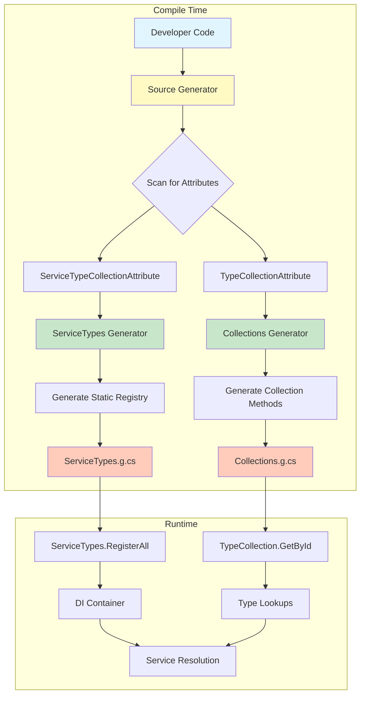
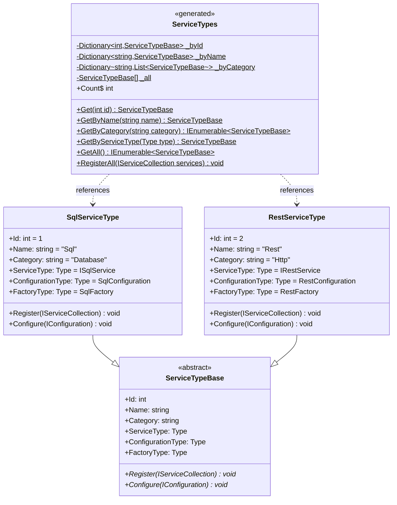
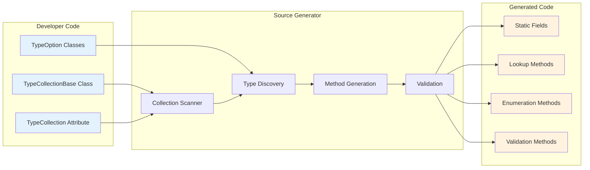
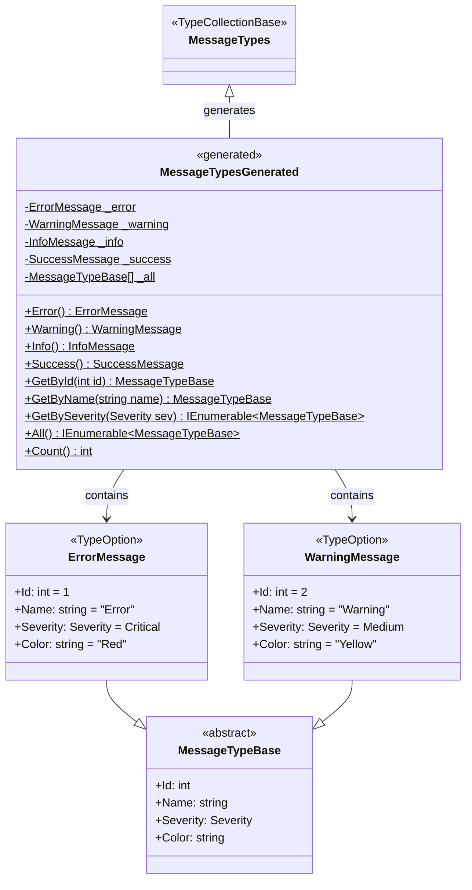
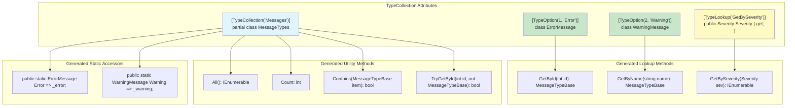
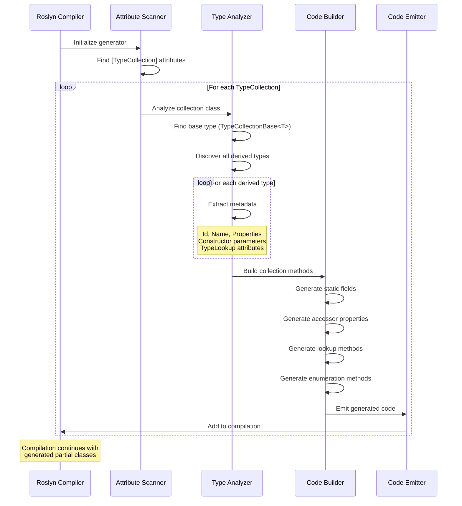

# FractalDataWorks Services Framework Documentation

## Executive Summary

The FractalDataWorks Services Framework provides a comprehensive, enterprise-grade service architecture built on .NET 10.0. This framework implements a sophisticated service factory pattern with source generation capabilities, type-safe configuration management, and structured messaging. Designed for high-performance distributed systems, it offers automatic service registration, validation, and lifecycle management through a plugin-based architecture.

## Architecture Overview

### Core Design Principles

1. **Type Safety First**: Every service interaction is strongly typed, eliminating runtime type errors
2. **Configuration-Driven**: Services are configured through validated, strongly-typed configuration objects
3. **Factory Pattern**: All service instantiation goes through factories for consistent lifecycle management
4. **Source Generation**: Heavy use of compile-time code generation for performance and maintainability
5. **Railway-Oriented Programming**: Result types ensure explicit error handling without exceptions
6. **Plugin Architecture**: Services can be dynamically discovered and loaded

### Framework Layers

```
┌─────────────────────────────────────────────────────────────┐
│                    Application Layer                        │
├─────────────────────────────────────────────────────────────┤
│                    Service Providers                        │
├─────────────────────────────────────────────────────────────┤
│           Service Factories & Service Instances             │
├─────────────────────────────────────────────────────────────┤
│      ServiceBase | Configuration | Commands | Messages      │
├─────────────────────────────────────────────────────────────┤
│    ServiceTypes | Collections | EnhancedEnums | Results     │
├─────────────────────────────────────────────────────────────┤
│              Source Generators & Analyzers                  │
└─────────────────────────────────────────────────────────────┘
```

### Source Generation Flow



## Project Structure

### FractalDataWorks.Services.Abstractions

**Purpose**: Defines the core contracts and interfaces for the service framework.

**Key Components**:

#### IGenericService Interface Hierarchy
```csharp
IGenericService                                    // Base service interface
├── IGenericService<TCommand>                     // Command-aware service
    └── IGenericService<TCommand, TConfiguration> // Configuration-aware service
        └── IGenericService<TCommand, TConfiguration, TService> // Fully typed service
```

#### Command Pattern Implementation
- `ICommand`: Base command interface for all service operations
- `ICommandBuilder`: Fluent API for constructing complex commands
- `ICommandResult`: Strongly-typed command execution results
- `ICommandTypeMetrics`: Performance and usage metrics for commands

#### Service Lifecycle Management
- `ServiceLifetimeBase`: Abstract base for service lifetime definitions
- `TransientServiceLifetimeOption`: New instance per request
- `ScopedServiceLifetimeOption`: Instance per scope/request
- `SingletonServiceLifetimeOption`: Single instance for application lifetime

#### Factory Pattern
```csharp
public interface IServiceFactory
{
    IGenericResult<IGenericService> Create(IGenericConfiguration configuration);
}

public interface IServiceFactory<TService> : IServiceFactory
{
    IGenericResult<TService> Create(IGenericConfiguration configuration);
}
```

### FractalDataWorks.Services

**Purpose**: Concrete implementations of the service framework with production-ready base classes.

**Key Components**:

#### ServiceBase<TCommand, TConfiguration, TService>
The foundation class for all services providing:
- Automatic logging integration via `ILogger<TService>`
- Configuration validation on instantiation
- Unique service instance identification
- Cancellation token support
- Generic and non-generic execution paths

```csharp
public abstract class ServiceBase<TCommand, TConfiguration, TService>
{
    protected ILogger<TService> Logger { get; }
    public TConfiguration Configuration { get; }
    public string Id { get; } = Guid.NewGuid().ToString();

    public abstract Task<IGenericResult> Execute(TCommand command);
    public abstract Task<IGenericResult<TOut>> Execute<TOut>(TCommand command);
}
```

#### ServiceFactoryBase<TService, TConfiguration>
High-performance factory implementation featuring:
- FastGenericNew for optimized instantiation (up to 10x faster than Activator.CreateInstance)
- Automatic configuration validation
- Structured logging at every step
- Type-safe service creation
- Fallback patterns for compatibility

#### ServiceFactoryProvider
Central service resolution mechanism:
- Manages all registered service factories
- Configuration-based factory selection
- Lazy loading of service implementations
- Thread-safe service caching options

#### Message System
Comprehensive messaging infrastructure:
- `ServiceMessage`: Base messages for service operations
- `FactoryMessage`: Factory-specific messages
- `RegistrationMessage`: Service registration events
- Message collections with source-generated lookups

### FractalDataWorks.ServiceTypes

**Purpose**: Defines the plugin architecture for service discovery and registration.

**Key Components**:

#### ServiceTypeBase Hierarchy
```csharp
ServiceTypeBase                                    // Non-generic base
├── ServiceTypeBase<TService>                     // Service-specific
    └── ServiceTypeBase<TService, TConfiguration> // With configuration
        └── ServiceTypeBase<TService, TConfiguration, TFactory> // Full definition
```

#### Plugin Architecture Features
- **Auto-Discovery**: Services are discovered at compile time
- **Category Organization**: Services grouped by functional category
- **Configuration Binding**: Automatic appsettings.json integration
- **DI Registration**: Self-registering services with IServiceCollection
- **Metadata Rich**: Display names, descriptions, and documentation

#### ServiceType Properties
```csharp
public abstract class ServiceTypeBase
{
    public int Id { get; }                    // Unique identifier
    public string Name { get; }               // Internal name
    public string Category { get; }           // Grouping category
    public Type ServiceType { get; }          // Service interface
    public Type ConfigurationType { get; }    // Configuration class
    public Type FactoryType { get; }          // Factory class
    public string SectionName { get; }        // Config section
    public string DisplayName { get; }        // UI display
    public string Description { get; }        // Documentation

    public abstract void Register(IServiceCollection services);
    public abstract void Configure(IConfiguration configuration);
}
```

### FractalDataWorks.ServiceTypes.SourceGenerators

**Purpose**: Compile-time code generation for service type collections.

**Generated Code Features**:
- Static service type registries
- Lookup methods by ID, name, category
- Compile-time validation of service definitions
- Zero-runtime-overhead service discovery
- IntelliSense-friendly generated APIs

#### ServiceTypes Generation Process

```mermaid
sequenceDiagram
    participant Dev as Developer
    participant Code as Source Code
    participant Gen as ServiceTypeGenerator
    participant Roslyn as Roslyn Compiler
    participant Out as Generated Code

    Dev->>Code: Define ServiceType class
    Note over Code: public class SqlServiceType :<br/>ServiceTypeBase<ISqlService,<br/>SqlConfig, SqlFactory>

    Dev->>Code: Add [ServiceTypeCollection] attribute
    Note over Code: [ServiceTypeCollection("ServiceTypes")]<br/>public partial class ServiceTypes

    Roslyn->>Gen: Trigger source generator
    Gen->>Code: Scan for ServiceTypeBase derivatives
    Gen->>Gen: Collect metadata (ID, Name, Category)
    Gen->>Gen: Generate lookup methods
    Gen->>Gen: Generate registration methods
    Gen->>Out: Emit ServiceTypes.g.cs

    Note over Out: public static partial class ServiceTypes {<br/>  private static readonly Dictionary<int, ServiceTypeBase> _byId;<br/>  private static readonly Dictionary<string, ServiceTypeBase> _byName;<br/>  public static ServiceTypeBase Get(int id);<br/>  public static ServiceTypeBase GetByName(string name);<br/>  public static void RegisterAll(IServiceCollection services);<br/>}

    Roslyn->>Roslyn: Compile with generated code
    Note over Roslyn: Full IntelliSense support<br/>Compile-time type checking
```

#### Generated ServiceTypes Structure



**Example Generated Code**:
```csharp
// ServiceTypes.g.cs - Generated at compile time
public static partial class ServiceTypes
{
    private static readonly Dictionary<int, ServiceTypeBase> _byId;
    private static readonly Dictionary<string, ServiceTypeBase> _byName;
    private static readonly Dictionary<string, List<ServiceTypeBase>> _byCategory;
    private static readonly ServiceTypeBase[] _all;

    static ServiceTypes()
    {
        var types = new ServiceTypeBase[]
        {
            new SqlServiceType(),
            new RestServiceType(),
            new RedisServiceType(),
            // ... all discovered ServiceType classes
        };

        _all = types;
        _byId = types.ToDictionary(t => t.Id);
        _byName = types.ToDictionary(t => t.Name);
        _byCategory = types.GroupBy(t => t.Category)
                          .ToDictionary(g => g.Key, g => g.ToList());
    }

    public static ServiceTypeBase Get(int id) => _byId.TryGetValue(id, out var type) ? type : null;
    public static ServiceTypeBase GetByName(string name) => _byName.TryGetValue(name, out var type) ? type : null;
    public static IEnumerable<ServiceTypeBase> GetByCategory(string category) =>
        _byCategory.TryGetValue(category, out var types) ? types : Enumerable.Empty<ServiceTypeBase>();

    public static void RegisterAll(IServiceCollection services)
    {
        foreach (var serviceType in _all)
        {
            serviceType.Register(services);
        }
    }
}
```

### FractalDataWorks.Collections

**Purpose**: Generic type collection infrastructure used throughout the framework.

**Key Components**:

#### TypeCollectionBase<TBase>
Foundation for all type collections:
- Compile-time collection generation
- Type-safe lookups
- Zero allocation enumeration
- Thread-safe by default

#### Attributes
- `[TypeCollection]`: Marks a class for collection generation
- `[TypeOption]`: Marks collection items
- `[TypeLookup]`: Generates specific lookup methods
- `[GlobalTypeCollection]`: Cross-assembly collections

### FractalDataWorks.Collections.SourceGenerators

**Purpose**: Source generation for type collections.

**Generated Features**:
- Static initialization of all collection items
- Multiple lookup strategies (ID, name, property)
- Enumeration helpers
- Count and existence checks
- LINQ-compatible operations

#### Collections Generation Process



#### Type Collection Generation Example



#### Generated Collection Methods



#### Source Generator Workflow



#### Generated Code Example

```csharp
// MessageTypes.g.cs - Generated at compile time
public partial class MessageTypes : TypeCollectionBase<MessageTypeBase>
{
    // Static instances
    private static readonly ErrorMessage _error = new ErrorMessage();
    private static readonly WarningMessage _warning = new WarningMessage();
    private static readonly InfoMessage _info = new InfoMessage();
    private static readonly SuccessMessage _success = new SuccessMessage();

    // Collection storage
    private static readonly MessageTypeBase[] _all = new[]
    {
        _error, _warning, _info, _success
    };

    private static readonly Dictionary<int, MessageTypeBase> _byId =
        _all.ToDictionary(x => x.Id);

    private static readonly Dictionary<string, MessageTypeBase> _byName =
        _all.ToDictionary(x => x.Name, StringComparer.OrdinalIgnoreCase);

    private static readonly ILookup<Severity, MessageTypeBase> _bySeverity =
        _all.ToLookup(x => x.Severity);

    // Static accessors
    public static ErrorMessage Error => _error;
    public static WarningMessage Warning => _warning;
    public static InfoMessage Info => _info;
    public static SuccessMessage Success => _success;

    // Lookup methods
    public static MessageTypeBase GetById(int id) =>
        _byId.TryGetValue(id, out var result) ? result : null;

    public static MessageTypeBase GetByName(string name) =>
        _byName.TryGetValue(name, out var result) ? result : null;

    public static IEnumerable<MessageTypeBase> GetBySeverity(Severity severity) =>
        _bySeverity[severity];

    // Collection methods
    public static IEnumerable<MessageTypeBase> All() => _all;
    public static int Count => _all.Length;
    public static bool Contains(MessageTypeBase item) => _all.Contains(item);

    // Try pattern methods
    public static bool TryGetById(int id, out MessageTypeBase result) =>
        _byId.TryGetValue(id, out result);

    public static bool TryGetByName(string name, out MessageTypeBase result) =>
        _byName.TryGetValue(name, out result);
}
```

## Service Lifecycle

### 1. Service Definition
```csharp
public class DataProcessingServiceType : ServiceTypeBase<IDataProcessor, DataConfig, DataFactory>
{
    public DataProcessingServiceType() : base(1, "DataProcessor", "Processing") { }

    public override void Register(IServiceCollection services)
    {
        services.AddTransient<DataFactory>();
        services.AddTransient<IDataProcessor, DataProcessor>();
    }
}
```

### 2. Service Implementation
```csharp
public class DataProcessor : ServiceBase<ProcessCommand, DataConfig, DataProcessor>
{
    public DataProcessor(ILogger<DataProcessor> logger, DataConfig config)
        : base(logger, config) { }

    public override async Task<IGenericResult> Execute(ProcessCommand command)
    {
        // Implementation with automatic logging and error handling
    }
}
```

### 3. Factory Implementation
```csharp
public class DataFactory : ServiceFactoryBase<IDataProcessor, DataConfig>
{
    public DataFactory(ILogger<DataFactory> logger) : base(logger) { }

    // Base class handles creation, validation, and logging
}
```

### 4. Service Registration
```csharp
// Automatic registration via ServiceTypes
ServiceTypes.RegisterAll(services);

// Or manual registration
services.AddServiceFactory<DataFactory>();
services.AddTransient<IDataProcessor, DataProcessor>();
```

### 5. Service Resolution
```csharp
public class ConsumerService
{
    private readonly IServiceFactoryProvider _provider;

    public async Task ProcessData()
    {
        var config = new DataConfig { ConnectionString = "..." };
        var result = await _provider.GetService<IDataProcessor>(config);

        if (result.IsSuccess)
        {
            var processor = result.Value;
            await processor.Execute(new ProcessCommand());
        }
    }
}
```

## Configuration Management

### Configuration Validation
All configurations implement `IGenericConfiguration` with FluentValidation:

```csharp
public class DataConfig : IGenericConfiguration
{
    public string ConnectionString { get; set; }
    public int Timeout { get; set; }

    public IGenericResult<ValidationResult> Validate()
    {
        var validator = new DataConfigValidator();
        var result = validator.Validate(this);
        return GenericResult<ValidationResult>.From(result);
    }
}

public class DataConfigValidator : AbstractValidator<DataConfig>
{
    public DataConfigValidator()
    {
        RuleFor(x => x.ConnectionString).NotEmpty();
        RuleFor(x => x.Timeout).GreaterThan(0).LessThanOrEqualTo(300);
    }
}
```

### Configuration Sources
1. **appsettings.json**: Automatic binding via section names
2. **Environment Variables**: Override capabilities
3. **Command Line**: Runtime configuration
4. **Azure Key Vault**: Secure configuration storage
5. **Database**: Dynamic configuration updates

## Messaging Architecture

### Message Types

#### Service Messages
- Configuration validation failures
- Service initialization events
- Execution start/complete notifications
- Performance metrics

#### Factory Messages
- Creation success/failure
- Type resolution issues
- Performance bottlenecks
- Resource constraints

#### Registration Messages
- Service registered/unregistered
- Factory availability changes
- Configuration updates
- Health status changes

### Message Flow
```
Command → Service → Validation → Execution → Result → Messages → Logging
                         ↓                      ↓
                    Configuration          Error Handling
```

## Performance Optimizations

### FastGenericNew Integration
- 10x faster service instantiation
- Compile-time constructor resolution
- Zero-allocation for known types
- Automatic fallback for dynamic types

### Source Generation Benefits
- Zero runtime reflection
- Compile-time validation
- Optimal code paths
- Reduced memory footprint

### Caching Strategies
- Service instance caching (singleton pattern)
- Configuration caching with invalidation
- Factory result caching
- Command result memoization

## Error Handling

### Railway-Oriented Programming
All operations return `IGenericResult<T>`:

```csharp
public async Task<IGenericResult<Data>> ProcessData(Request request)
{
    return await ValidateRequest(request)
        .Bind(GetConfiguration)
        .Bind(CreateService)
        .Bind(service => service.Execute(request))
        .Map(result => result.Data);
}
```

### Error Categories
1. **Configuration Errors**: Invalid or missing configuration
2. **Validation Errors**: Business rule violations
3. **Factory Errors**: Service creation failures
4. **Execution Errors**: Runtime operation failures
5. **System Errors**: Infrastructure issues

## Logging Integration

### Structured Logging
All components use structured logging with Microsoft.Extensions.Logging:

```csharp
GenericConnectionProviderLog.GettingConnection(_logger, configuration.ConnectionType);
GenericConnectionProviderLog.ConnectionCreated(_logger, configuration.ConnectionType);
GenericConnectionProviderLog.ConnectionCreationFailed(_logger, type, error);
```

### Log Levels
- **Trace**: Detailed execution flow
- **Debug**: Development diagnostics
- **Information**: Normal operations
- **Warning**: Configuration issues, retries
- **Error**: Operation failures
- **Critical**: System failures

## Security Considerations

### Configuration Security
- Sensitive data never logged
- Configuration validation prevents injection
- Secure defaults enforced
- Encryption at rest support

### Service Isolation
- Services run in isolated contexts
- Resource limits enforced
- Permission boundaries respected
- Audit trail maintained

## Testing Support

### Unit Testing
```csharp
[Fact]
public async Task DataProcessor_Should_Process_Valid_Command()
{
    var logger = new TestLogger<DataProcessor>();
    var config = new DataConfig { ConnectionString = "test" };
    var processor = new DataProcessor(logger, config);

    var result = await processor.Execute(new ProcessCommand());

    result.IsSuccess.Should().BeTrue();
    result.Value.Should().NotBeNull();
}
```

### Integration Testing
```csharp
[Fact]
public async Task ServiceFactory_Should_Create_Valid_Service()
{
    var services = new ServiceCollection();
    ServiceTypes.RegisterAll(services);
    var provider = services.BuildServiceProvider();

    var factory = provider.GetService<DataFactory>();
    var result = factory.Create(new DataConfig());

    result.IsSuccess.Should().BeTrue();
}
```

## Best Practices

### Service Design
1. Keep services focused on single responsibility
2. Use commands for all operations
3. Validate configuration early
4. Log at appropriate levels
5. Handle cancellation properly
6. Return meaningful results

### Configuration Design
1. Use strong typing for all settings
2. Implement comprehensive validation
3. Provide sensible defaults
4. Document all properties
5. Support configuration composition

### Factory Design
1. Validate before creation
2. Cache when appropriate
3. Log creation metrics
4. Handle disposal properly
5. Support async creation

## Migration Guide

### From Legacy Services
1. Identify service boundaries
2. Create ServiceType definitions
3. Implement ServiceBase inheritance
4. Add configuration classes
5. Create factories
6. Update DI registration
7. Test thoroughly

### Version Compatibility
- Framework targets .NET 10.0 and .NET Standard 2.0
- Backwards compatible with .NET 6.0+
- Source generators require .NET 6.0+ SDK
- Full async/await support throughout

## Performance Metrics

### Benchmarks
- Service creation: <100ns with FastGenericNew
- Configuration validation: <1ms typical
- Message routing: <10ns per message
- Factory resolution: <50ns cached
- Command execution: Depends on implementation

### Resource Usage
- Memory: ~1KB per service instance
- CPU: Negligible overhead
- Threads: Fully async, no blocking
- Connections: Pooled and managed

## Troubleshooting

### Common Issues

#### Service Creation Fails
- Check configuration validation
- Verify DI registration
- Review factory implementation
- Check constructor parameters

#### Configuration Not Loading
- Verify section name
- Check JSON structure
- Review binding attributes
- Validate environment variables

#### Performance Issues
- Enable service caching
- Review async patterns
- Check database queries
- Profile hot paths

## Future Roadmap

### Planned Features
1. Distributed service mesh support
2. GraphQL integration
3. gRPC service generation
4. OpenTelemetry native support
5. Service versioning
6. Hot reload capabilities
7. Cloud-native patterns
8. Event sourcing integration

### Under Consideration
- Service orchestration
- Saga pattern support
- Distributed transactions
- Service discovery
- Circuit breaker patterns
- Rate limiting
- Caching strategies
- Multi-tenancy

## Support and Resources

### Documentation
- API Reference: Generated from XML documentation
- Sample Projects: Available in samples/ directory
- Video Tutorials: Coming soon
- Architecture Decisions: See ADR folder

### Community
- GitHub Issues: Bug reports and feature requests
- Discussions: Architecture and design topics
- Stack Overflow: Tag with 'FractalDataWorks'
- Discord: Real-time support

## License and Credits

Developed by FractalDataWorks Engineering Team
Lead Architect: Mike Blair
Copyright © 2024 FractalDataWorks Electric Cooperative

Built on:
- .NET 10.0
- Microsoft.Extensions.*
- FluentValidation
- FastGenericNew
- Serilog (optional)